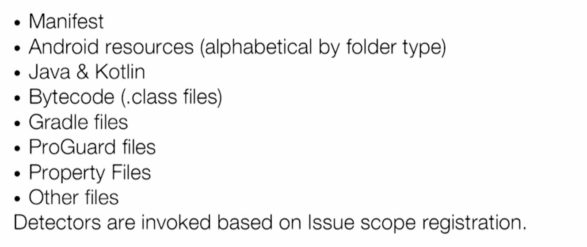

# 扫描器类别

当我们实现 Detector 的时候，需要实现对应的 Scanner 接口来指定扫描的文件类型。

| 接口名 | 作用 |
| --- | --- | --- | --- | --- | --- | --- | --- | --- | --- | --- |
| ~~JavaScanner~~ |  已废弃。不支持1.6以上的Java，类型解析能力弱。  |
| ~~JavaPsiScanner~~ | 已废弃。不支持Kotlin。 |
| UastScanner | Java 或 Kotlin 的源码进行扫描。 |
| SourceCodeScanner | 别名，与 UastScanner 等价。向后兼容。 |
| ClassScanner | 对编译后的字节码文件进行扫描。 |
| BinaryResourceScanner | 扫描二进制资源文件，像 Bitmap 或者 res/raw 目录下文件。 |
| ResourceFolderScanner | 扫描资源文件夹，不包含里面的东西。 |
| XmlScanner | 扫描 XML 文件。 |
| GradleScanner | 扫描 Gradle 文件。 |
| OtherFileScanner | 扫描其他文件。 |

这些接口都是标记接口，在 Detector 中有默认的实现。在整个静态代码扫描过程中，Detector 会按照下面的顺序来进行扫描：



我们没办法让 **Detector** 在一次扫描中先扫描代码文件再扫描资源文件，但我们可以进行多次扫描。通过 `context.driver.requestRepeat` 来申请指定的 **Detector** 再次工作。

```kotlin
override fun afterCheckProject(context: Context) {
    if (context.phase == 1) { //如果第1次扫描结束
        context.driver.requestRepeat(this,
                EnumSet.of(Scope.JAVA_FILE))
    }
}
```



