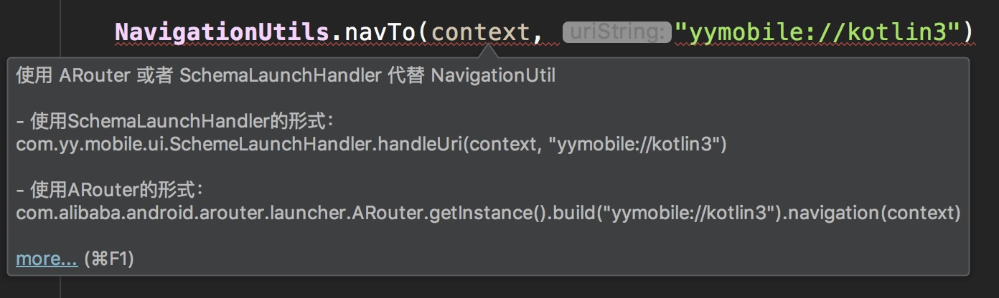
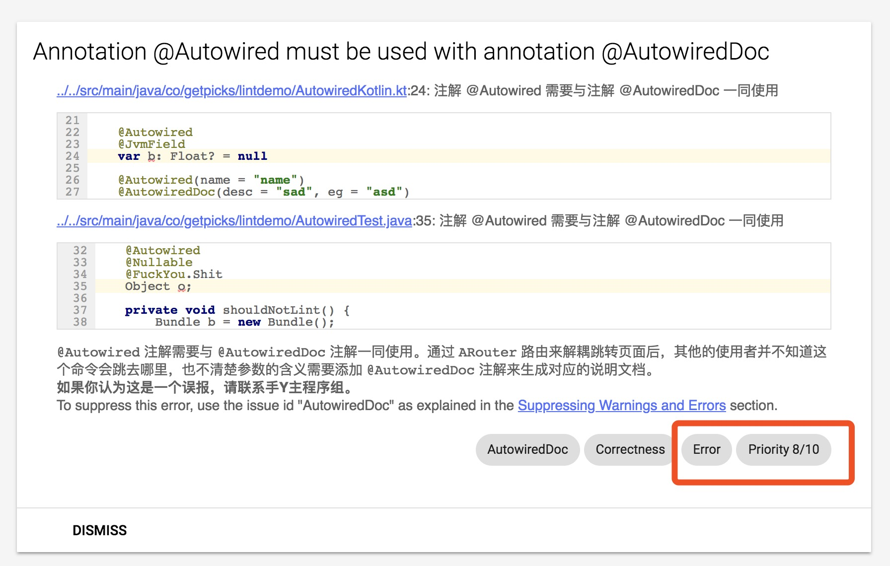
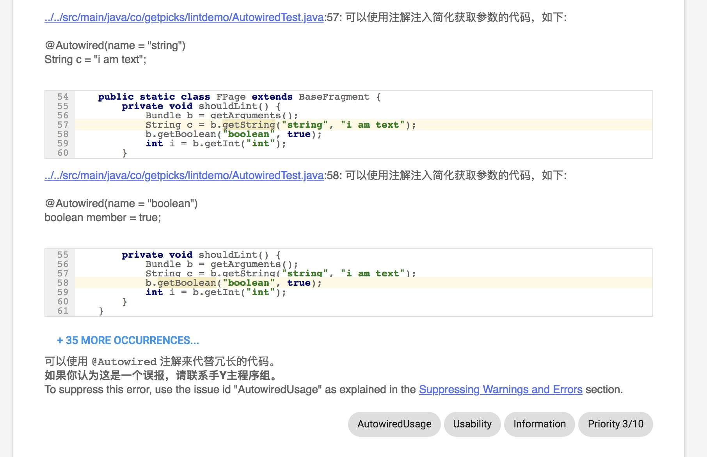
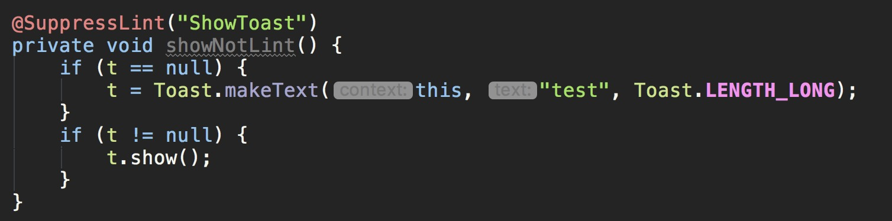
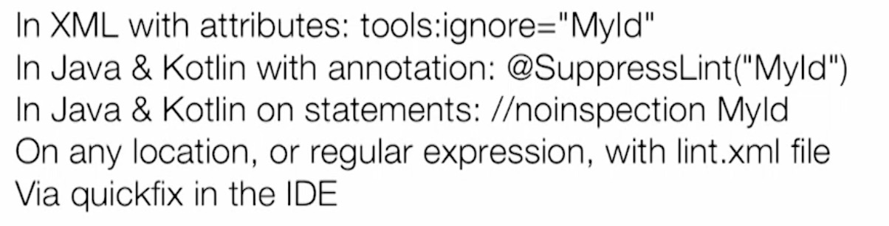

# 手Y Android端 代码检阅

## Android Lint

**Android Lint** 是在 Android Studio 中集成的一套静态代码分析工具，它可以帮助我们检查项目中存在的问题，让我们更有规范性地开发。通过 **Lint** 的检查规则，我们可以更有预见性地发现问题，更好地统一庞大的团队的技术选型，更有指向性地列出怎样地编码才是适合我们的项目。

**Lint** 可以在我们编写代码的过程中指出哪些方法使用是错误的，比如：

我们希望统一整个工程中千奇百怪的页面跳转方式，因此会对一些废弃的旧方法进行错误级别的提醒，并给出期望的使用方法。在Java文件中我们可以通过 `Quick Fix` 的快捷键快速修改成规则引导的代码。更多关于 `Quick Fix` 的信息可以[看这里](customrule/lintfix.md)。

我们会尝试通过多维度的方式保证静态代码扫描的有效性。在本地编译，构建系统编译等这些节点会插入自定义静态扫描的任务，针对版本控制工具提供的有修改的文件列表，进行增量扫描，并在发现有严重级别为 `Error`的 **Issue** 时进行阻断。更多关于 **Issue** 的信息可以[看这里](issue/)。

## 检阅报告

在完成代码检阅后，我们会收到 xml 和 html 两种格式的结果报告。然后可以根据报告的内容对代码进行修改。报告会把根据 **Issue** 进行模块分类，需要对右下角标明为 `Error` 级别的问题进行修改。比如：

同时报告中也会有严重级别为 `Information` 的 **Issue** 。这些 **Issue** 并不需要修改，只是作为一种补充信息，希望开发人员大概知道有这么回事就可以了。比如：

## 抑制扫描

静态扫描规则有一定的局限性。如果认为提示不合适，可以通过注解的方式限制报告。比如：

还有更多的抑制方式：


对于手Y的自定义规则，如果你发现任何问题，请一定要告知我们。


