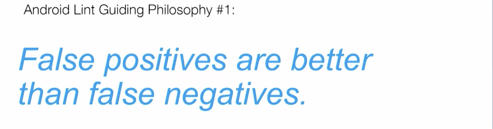

# 代码检阅

## Issue

**Issue** 是静态代码扫描的基本元素。每一个问题都是一条单独的 **Issue**，**Lint** 本身内置了大量 **Issue** 规则。

**Lint** 会根据注册好的 **Issue** 来进行扫描，可以通过继承 **Lint API** 中的  `IssueRegistry` 类，并重写 `getIssues` 方法来返回我们自定义的 **Issue**。

每个 **Issue** 需要指定一个 **Detector**，**Detector** 负责实现具体的代码扫描逻辑。多个 **Issue** 可以指定相同的**Detector**。

## Lint Check 的原则

直接贴 KotlinConf 2017 上的ppt。很好理解：

* [x] 误报比漏报好
* [x] Lint 只注重检查 Android 相关的问题

