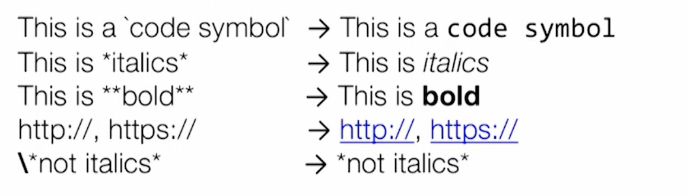

# 其他

## 文本格式

**Lint** 提供了 `TextFormat` 这个类来完成文本格式的转换。这个类常用于把我们 **Issue** 上的文本转化成输出报告的格式，比如 XML 和 HTML。在**Issue**的 `explaination` 中，我们可以使用一些 markdown 语法来丰富文本，但仅限于下面这几种简单的语法：



我们在代码上直接编写的 "i \*am\* text" 文本是 **TextFormat.RAW** 类型，可以通过 `TextFormat.convertTo` 方法来转换成 **TextFormat.TEXT** 或者是 **TextFormat.HTML** 类型。

## 扫描范围

在Issue实现时我们需要指定扫描的范围，范围可以在 `Scope` 类中看到具体的枚举和注释解释。常用的一般是 **JAVA\_FILE** 扫描 `Java` 或 `Kotlin` 源码，**RESOURCE\_FILE** 扫描资源文件。

```text
/**
 * The analysis only considers a single XML resource file at a time.
 *
 * Issues which are only affected by a single resource file can be checked
 * for incrementally when a file is edited.
 */
RESOURCE_FILE,

/**
 * The analysis only considers a single binary (typically a bitmap) resource file at a time.
 *
 * Issues which are only affected by a single resource file can be checked
 * for incrementally when a file is edited.
 */
BINARY_RESOURCE_FILE,

/**
 * The analysis considers the resource folders (which also includes asset folders)
 */
RESOURCE_FOLDER,

/**
 * The analysis considers **all** the resource file. This scope must not
 * be used in conjunction with [.RESOURCE_FILE]; an issue scope is
 * either considering just a single resource file or all the resources, not
 * both.
 */
ALL_RESOURCE_FILES,

/**
 * The analysis only considers a single Java source file at a time.
 *
 * Issues which are only affected by a single Java source file can be
 * checked for incrementally when a Java source file is edited.
 */
JAVA_FILE,

/**
 * The analysis considers **all** the Java source files together.
 *
 * This flag is mutually exclusive with [.JAVA_FILE].
 */
ALL_JAVA_FILES,

/**
 * The analysis only considers a single Java class file at a time.
 *
 * Issues which are only affected by a single Java class file can be checked
 * for incrementally when a Java source file is edited and then recompiled.
 */
CLASS_FILE,

/**
 * The analysis considers **all** the Java class files together.
 *
 * This flag is mutually exclusive with [.CLASS_FILE].
 */
ALL_CLASS_FILES,

/** The analysis considers the manifest file  */
MANIFEST,

/** The analysis considers the Proguard configuration file  */
PROGUARD_FILE,

/**
 * The analysis considers classes in the libraries for this project. These
 * will be analyzed before the classes themselves. NOTE: This excludes
 * provided libraries.
 */
JAVA_LIBRARIES,

/** The analysis considers a Gradle build file  */
GRADLE_FILE,

/** The analysis considers Java property files  */
PROPERTY_FILE,

/** The analysis considers test sources as well  */
TEST_SOURCES,

/**
 * Scope for other files. Issues that specify a custom scope will be called unconditionally.
 * This will call [Detector.run]} on the detectors unconditionally.
 */
OTHER;
```

## 注解类扫描

在编写自定义规则时发现，如果注解类没有添加 `@Target` 注解，会无法被 **Detector** 访问到。

