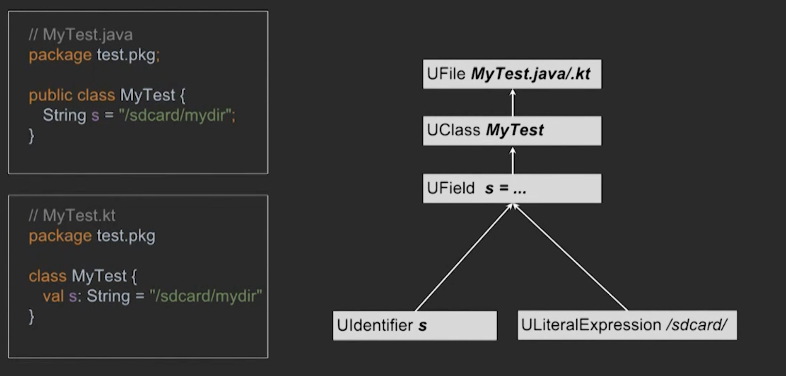

# 语法树

## Uast

**Uast** 指的是通用抽象语法树。每个 Java 或者 Kotlin 文件都会解析成一个以 **UFile** 为跟节点的语法树，有 **UClass** 、**UMethod** 、**UExpression** 逐层节点等等。



语法树节点的类型非常多，我们没有必要全部去了解之后再编写规则。我们可以先编写需要被检测的代码，然后在 **Detector** 中把语法树打印出来，从而找到对应的 **UElement** 类型:

```kotlin
class LogForLearn : Detector(), Detector.UastScanner {

    companion object {
        //private val Learning: Issue = ...
    }

    override fun getApplicableUastTypes() =
            listOf(UElement::class.java)

    override fun createUastHandler(context: JavaContext): UElementHandler? {
        System.out.println(context.uastFile?.asRecursiveLogString())
        return null
    }
}
```

通过 `asRecursiveLogString()` 方法可以把递归地把整个语法树打印出来，对于下面这个被检查的类

```java
package com.yy.mobile.lintdemo;

public class Demo {

    float method1() {
        return new InnerDemo().method2();
    }

    private static class InnerDemo {

        int method2() {
            return 233333;
        }
    }
}
```

可以打印出如下的结果

> UFile \(package = com.yy.mobile.lintdemo\)
>
>     UClass \(name = Demo\)
>
>         UMethod \(name = method1\)
>
>             UBlockExpression
>
>                 UReturnExpression
>
>                     UQualifiedReferenceExpression
>
>                         UCallExpression \(kind = UastCallKind\(name='constructor\_call'\), argCount = 0\)\)
>
>                             USimpleNameReferenceExpression \(identifier = InnerDemo\)
>
>                         UCallExpression \(kind = UastCallKind\(name='method\_call'\), argCount = 0\)\)
>
>                             UIdentifier \(Identifier \(method2\)\)
>
>         UClass \(name = InnerDemo\)
>
>             UMethod \(name = method2\)
>
>                 UBlockExpression
>
>                     UReturnExpression
>
>                         ULiteralExpression \(value = 233333\)

注意 `asRecursiveLogString()` 方法只能在 Gradle 3.1.2 上使用，不然我们只能在 `visitElement` 方法中调用 node 的 `asLogString` 方法，把所有节点打印出来。

我们可以通过这些节点中的属性来完成检测。

## Psi

**Psi** 指的是program structure interface。抽象语法树上每一个节点都是 UElement 的子类，每个 UElement 都可以与对应的 PsiElement 相互转化。比如 UCallExpression 通过[类型解析](resolve.md)可以获得一个 PsiMethod 对象。

**Psi** 主要用于 "outside methods"，而 **Uast** 用于 "inside methods"。如果我们需要类型判断，比如判断一个表达式的结果是否是 `java.lang.String` 类型，又或者判断一个参数的类型是否继承了某个父类或实现了某个接口，这时候要使用 **Psi** 类型。如果要获取一个节点的内容，比如方法的方法体，或者是节点的属性，我们应该使用 **Uast**。

## Kotlin 差异

需要注意 Kotlin 与 Java 的语法差异，常常会忽略一些特定的情况。比如我们希望扫描一个方法的返回值，在 Java 中可以直接扫描 **UReturn** 节点。但在 Kotlin 中，允许返回值没有 `return` 关键字，比如：

```kotlin
fun sum(a:Int, b:Int) = a + b
```


